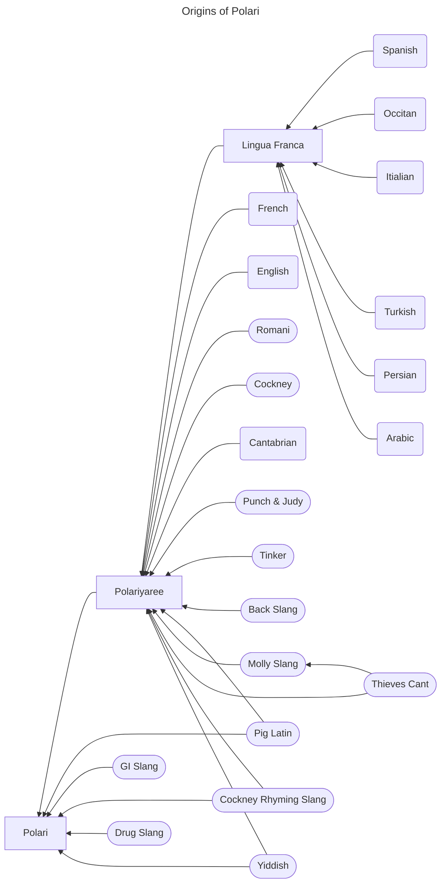

Chapter 5. Polari Culture and History
=====================================

History and origins of Polari
-----------------------------

Polari is a unique and fascinating language that has its roots in a variety of sources, including Lingua Franca, Polariyari, thieves cant, Yiddish, Pig Latin, back slang, molly slang, Cockney Rhyming Slang and many more pigeon languages, dialects & sub cultures. These disparate influences combined to create a language that was both functional and expressive, and that was particularly well-suited to use by marginalized communities.

Lingua Franca was a pidgin language used by traders and sailors in the Mediterranean during the Middle Ages. It combined Italian, Spanish, French, and Arabic, among other languages, to create a simple and functional language for communication between people who spoke different native languages.

Polariyari, on the other hand, was a language used by fairground and circus workers in the 19th century. It involved using a unique set of slang terms and phrases to communicate with each other, often in the presence of customers who wouldn't understand what they were saying. It drew heavily on Lingua Franca, Romani and many other sources.

Back slang was another important influence on Polari. This involved reversing words, so that "back" became "kcab," for example. It was often used by street vendors and market traders in the 19th century to communicate with each other without customers understanding what they were saying.

Molly slang, meanwhile, was a language used by prostitutes in 18th century London. It involved using a set of coded terms and phrases to communicate with each other, often in the presence of clients who wouldn't understand what they were saying.

Polari drew on all these influences, as well as others, to create a language that was both functional and expressive. It was particularly popular among LGBT communities in the mid-20th century, when it became a secret code used by gay men to communicate with each other without fear of persecution or misunderstanding.

Polari in entertainment and media
---------------------------------

Polari has a rich history in entertainment and media, particularly in the world of theatre. In the mid-19th century, Polari became the language of actors and traveling entertainers and from there spread to the LGBTQ+ community, allowing them to communicate with each other while on the road without others understanding their conversations. This helped create a sense of camaraderie and belonging within the LGBTQ+ community.

One of the most famous examples of Polari in entertainment is the radio program "Round the Horne," which aired on the BBC from 1965 to 1968. The show featured two recurring characters, Julian and Sandy, who spoke almost entirely in Polari. Actors Hugh Paddick and Kenneth Williams played Julian and Sandy, respectively, and their Polari-infused banter became an instant hit with audiences.

In the movies Polari is quite heavily used in the Carry On series of films probably because one of the stars and main contributors was Kenneth Williams who even wrote his diaries in Polari.

Polari was also used heavily in the theatre world, particularly in musical revues and variety shows. Performers would often use Polari to communicate with each other backstage or to make witty and humorous comments about the audience.

In music, Polari has been used by artists such as Morrissey, who has incorporated Polari phrases into his lyrics. The use of Polari in music helps to continue the language's legacy and keep it relevant in contemporary culture.

While Polari is not as widely used in entertainment and media today, its influence can still be seen in certain areas. For example, the popular drag performer RuPaul often uses Polari slang on his reality show "RuPaul's Drag Race," introducing it to a new generation of viewers.

Overall, Polari's place in entertainment and media history is a testament to the resilience and creativity of the LGBTQ+ community. Despite being marginalized and oppressed, they were able to create a language and culture that was uniquely their own, and that continues to inspire and entertain people today.

Polari in LGBT communities
--------------------------

Polari has a rich history in the LGBTQ+ communities of the United Kingdom. During the mid-20th century, when homosexuality was illegal and heavily stigmatized, Polari provided a secret language that allowed gay men to communicate with each other without fear of persecution.

The rise of Polari in the LGBTQ+ community can be traced back to the trial of Oscar Wilde in 1895. Wilde was a celebrated writer and playwright who was convicted of homosexual acts and sentenced to two years in prison. His trial sparked a wave of homophobia and persecution against the LGBTQ+ community, which forced many gay men to go underground and seek refuge in secret spaces.

Polari emerged as a way for these men to communicate with each other without arousing suspicion. It was a mix of Italian, Yiddish, Romani, and Cockney rhyming slang, which made it almost incomprehensible to outsiders. It allowed gay men to express themselves freely and form close-knit communities, despite the threat of persecution.

Polari was not just a language, but also a way of creating a sense of community and belonging among LGBTQ+ people. It was used to share news, gossip, and jokes, and to create a sense of camaraderie and solidarity.

Polari was also used as a form of self-expression and rebellion against the mainstream culture. Many Polari words were borrowed from Romani, Yiddish, Italian, and other languages, and the language itself was characterized by playful wordplay and innuendo.

In the 1950s and 1960s, Polari became more widespread among the LGBTQ+ community. It was often used in underground bars, clubs, and cafes, where gay men would gather to socialize and form relationships. It became a powerful tool for creating a sense of identity and belonging in a world that was hostile to LGBTQ+ people.

Polari's popularity began to decline in the 1970s as the LGBTQ+ community became more visible and accepted in mainstream society. However, it still holds a special place in the hearts of many LGBTQ+ people, especially those who lived through the darker days of persecution and discrimination.

Today, Polari is celebrated as a unique and important part of LGBTQ+ history and culture. It has been featured in movies, Radio & TV shows, and literature, and continues to be used as a way for LGBTQ+ people to connect with their past and each other.

Learning Polari can be a way to connect with this rich history and culture and to pay homage to the LGBTQ+ pioneers who used the language to fight for their rights and express their identities. It can also be a fun and playful way to communicate with other LGBTQ+ people and to create a sense of community and belonging.

Polari in the British navy and merchant navy
--------------------------------------------

In the navy, Polari was used as a way for sailors to communicate discreetly about their sexual desires and experiences. It was also used to identify other gay sailors and to form networks of support and companionship. Many sailors who were gay felt isolated and alone, and Polari allowed them to connect with others who shared their experiences.

In the merchant navy, Polari was used by sailors of all sexual orientations as a way to communicate in a noisy and busy environment. It allowed them to talk discreetly about their work, their lives, and their experiences, without being overheard by others.

Polari was particularly useful in the merchant navy, where sailors often came from different parts of the country and spoke different dialects and accents. Polari provided a common language that everyone could understand, regardless of their regional background.

Polari was not only important for sailors in the British navy and merchant navy but also for other subcultures around the world. The popularity of Polari in these groups helped to foster its use as a basis for other fringe and LGBTQ+ languages.

For example, in New Zealand, the "Bog Boys," a colloquial term for male prostitutes, had their own language which drew heavily on Polari. This language allowed them to communicate with each other about their experiences and to form networks of support and companionship. Similar to how Polari functioned in the British navy, merchant navy, and LGBTQ+ community, this language provided a common way of communicating that helped to bring people together and create a sense of community.

Polari's influence can also be seen in other LGBTQ+ cultures around the world, where people have developed their own slang and cant that draw on Polari's unique vocabulary and grammar. This demonstrates the enduring legacy of Polari and its importance as a cultural artefact.

The use of Polari in the navy and merchant navy declined in the 1960s as society became more accepting of homosexuality and other subcultures. However, it remains an important part of LGBTQ+ history in the United Kingdom, and it continues to be celebrated by those who value its unique history and cultural significance.

Polari and criminal slang
-------------------------

In addition to its use in LGBTQ+ subcultures, Polari was also used in criminal circles as a way to communicate discreetly about illegal activities. Criminal slang and Polari share many similarities, including the use of code words and phrases to convey information without being understood by outsiders.

Polari was particularly useful for criminals who were trying to evade police surveillance and detection. The language allowed them to talk about their plans and activities without arousing suspicion, and it also allowed them to identify other criminals and form networks of support and protection.

Despite the decline in its use in the 1960s, Polari has survived to this day and continues to be spoken by a small but dedicated group of people.

Similarly, criminal slang has evolved and adapted over time to reflect changes in the criminal underworld and law enforcement practices. Though it is no longer used heavily by the criminal fraternity I am aware it is still spoken in some UK prisons.

Whether used for subversion, survival, or secrecy, the enduring legacy of Polari and criminal slang is a testament to the power of language and its ability to bring people together, even in the most difficult and challenging of circumstances.

Polari and the law
------------------

Polari's use was not limited to criminal activities but also had implications for legal issues. At one point in history, homosexuality was illegal, and Polari provided a way for gay people to talk about their experiences and desires without being understood by outsiders, including the police.

During the 1950s and early 1960s, the British police started to crack down on homosexual activity and began to actively seek out and arrest gay men. Polari, which had been used for decades as a way of communicating about homosexuality without being detected, suddenly became a liability.

As the police became more familiar with Polari, they began to use it as evidence in court, arguing that the use of the language proved that the accused were gay and therefore engaging in illegal activities.  However, the use of Polari in court as evidence was often unsuccessful. The language was complex and not well-understood by most people, including many judges and lawyers. This made it difficult to prove that the language was being used in a way that proved illegal activity.

While the use of Polari in legal cases was not always successful, it did have an impact on the language's use in LGBTQ+ subcultures. As the threat of arrest and prosecution increased, many gay men began to abandon Polari in favour of more conventional language to avoid suspicion and detection.

Despite this, the use of Polari in the face of legal persecution is a testament to the language's importance as a means of resistance and self-expression. The host of Polari words and phrases for the police gives testament to the Polari speaking communities' tense relationship with the police.

Betty Bracelets, Charpering Omi, Hilda Handcuffs, Jennifer Justice, Lilly Law and Orderly Daughters were all used to refer to the police in Polari and as I'm sure you've noticed they were also used to take the police down a peg or two.

Polari remains an important part of LGBTQ+ history and culture, and its legacy continues to inspire and influence people around the world today.

Polari and race
---------------

It is important to acknowledge the problematic and exclusionary history of Polari when it comes to race. Unfortunately, the language was not immune to the racism and discrimination that existed in British society at the time.

Polari speakers would use derogatory terms like "dingeomi", "goolieomi", and "schwartzomi". These terms were used to exclude and marginalize People of Colour from the Polari-speaking community.

Furthermore, Polari was often used to express racist attitudes and behaviour. For example, phrases like "I've seen you looking for trade in the dinge quarter" were not uncommon. This phrase not only displays a derogatory term for People of Colour, but also implies that they are less valuable and desirable as sexual partners.

It is important to acknowledge and learn from the problematic aspects of Polari's history. As a language, it has evolved and adapted to become more inclusive and accepting, but we must continue to be vigilant against harmful language and attitudes. By being aware of the language we use and its impact, we can create a more welcoming and respectful environment for all people.

Polari and women
----------------

While there is limited evidence of women speaking Polari, the historical record primarily focuses on its usage among gay men. Jo Purvis, a prominent figure in the LGBTQ+ community, is occasionally cited as one of the few women known to have spoken Polari. Purvis's involvement in LGBTQ+ activism and her role as a gay icon are well-documented, but evidence of her actual usage of Polari remains sparse. One notable instance is Purvis's appearance in the Channel 4 documentary "Summer's Out," where she discussed using Polari. The documentary also featured a sketch involving two lesbians conversing in Polari, offering a rare glimpse into the language's potential usage among women.

The scarcity of evidence regarding women speaking Polari reflects broader gender dynamics within the mid-20th century LGBTQ+ community. Polari was primarily used in male-dominated spaces such as gay bars, clubs, and theatrical circles, where it served as a coded language for communication and camaraderie among gay men. The lack of documentation of women speaking Polari underscores the challenges of reconstructing their linguistic practices within these predominantly male social contexts.

Historical records of Polari usage among women are further complicated by the marginalization and invisibility of LGBTQ+ women in mainstream narratives. While anecdotal accounts and oral histories may suggest occasional instances of women speaking Polari, the absence of extensive documentation limits our understanding of the breadth and depth of their linguistic engagement. Without robust archival evidence, piecing together the linguistic practices of LGBTQ+ women in mid-20th century Britain remains a challenging endeavour.

While figures like Jo Purvis may offer tantalizing glimpses into this aspect of LGBTQ+ history, the absence of extensive documentation necessitates caution in drawing definitive conclusions. Moving forward, it is crucial to remain vigilant in uncovering and amplifying the voices of LGBTQ+ women, ensuring that their contributions to linguistic and cultural heritage are recognized and celebrated.

Polari and the transgender community
------------------------------------

The transgender community has always been an important part of the LGBT+ community, and many transgender individuals spoke Polari. However, it is important to note that the language's lexicon was limited when it came to describing transgender individuals. The only word used in Polari to describe someone as transgender is "remodel," which can be seen as highly derogatory.

It is important to acknowledge that Polari was a language that developed among gay men and lesbians, and therefore, its vocabulary was largely focused on these communities. However, this does not mean that trans fem., trans masc., non-binary or other gender divers individuals were excluded from using the language or being a part of the community that spoke it.

In recent years, there has been a growing recognition of the need to include and celebrate the experiences of trans individuals within the LGBT+ community. As such, efforts have been made to develop new vocabulary and terminology that reflects the diversity of gender identities and expressions.

Polari and the disabled community
---------------------------------

Polari, as a language, primarily emerged and evolved within LGBTQ+ subcultures and various communities in the United Kingdom. While there is no evidence to suggest that disabled people were specifically excluded or subjected to derogatory treatment within Polari-speaking communities, it is important to acknowledge that the language's development and usage primarily focused on LGBTQ+ identity and experiences.

In Polari, there are no words or phrases that specifically refer to disabled individuals. However, Polari does possess a creative aspect that allows for wordplay and the potential to adapt existing terms to describe specific characteristics or experiences. For instance, through conjugation, one could use "Aunty Nelly Cheat" to refer to a deaf person, combining the term "Aunty Nelly" (a term used in Polari to refer to ears) with "Cheat" to signify their deafness. Similarly, "Vada/Ogle Cheat" could be used to refer to a blind person, utilizing the words "Vada" or "Ogle" (which mean "to see" and "Eyes" respectively in Polari) with "Cheat" to convey their blindness.

It is essential to approach the topic of disability and language with sensitivity and respect. While Polari may not have a significant historical connection to disabled communities, it is crucial to consider the diverse experiences and identities within the broader LGBTQ+ and disabled communities.

Creating an inclusive environment requires recognizing and understanding the distinct needs and experiences of individuals with disabilities. It is always important to prioritize the use of person-first language, which places the person before their disability, and to be receptive to individual preferences and cultural nuances when communicating and referring to disabled individuals.

It is essential to embrace inclusive practices and foster an environment that respects the experiences and identities of all individuals, including those with disabilities. Language plays a powerful role in shaping perceptions and promoting inclusivity, and by being mindful of our words and actions, we can contribute to a more inclusive and supportive society for all.

Polari and class
----------------

Polari, as a secret language, was primarily used by lower class and lower middle-class LGBT+ individuals who needed to communicate with each other without being understood by the general public. This was especially true in a time when homosexuality was illegal and highly stigmatized.

Upper class LGBT+ individuals, on the other hand, were often able to defend themselves and their social status in other ways. They could use their wealth and influence to avoid prosecution and discrimination. In some cases, they may have even used their social status as a shield against homophobic attacks.

It's worth noting that Polari wasn't exclusively used by lower class individuals. There were some middle-class LGBT+ individuals who spoke Polari, particularly those involved in the arts and entertainment industry. However, most Polari speakers were working class or from impoverished backgrounds.

Despite its association with the lower classes, Polari played an important role in unifying the LGBT+ community across class boundaries. In a time when LGBT+ people faced intense discrimination and isolation, Polari provided a sense of community and belonging. It allowed individuals from different social backgrounds to come together and communicate freely, without fear of persecution or judgment based on their class status.

Julian & Sandy: Round the Horne
-------------------------------

Julian and Sandy were waiting inside the Montrell Cheat as the tourists arrived. The tourists looked a bit bewildered as they peered inside the small and shabby-looking box.

"Welcome aboard the Montrell Cheat, darlings," Sandy said with a flourish, while Julian tried to manoeuvre the tourists into the cramped space.

"Watch your step, sweetie," Julian warned as one of the tourists stumbled slightly.

"Is this thing really a time machine?" one of the tourists asked sceptically.

"Of course, my dear," Sandy replied with a grin. "The Montrell Cheat can take us anywhere and any when we want to go. It's a bit naff-looking, but it gets the job done."

Julian and Sandy pulled some levers and pressed some buttons, and suddenly the Montrell Cheat started to shake and rattle. The tourists looked alarmed, but Julian and Sandy just laughed and assured them that everything was perfectly normal.

After a few minutes, the shaking stopped, and when Julian opened the door, the tourists found themselves in the recording studio where Round the Horne was being recorded.

As Julian and Sandy entered the studio, they greeted the tourists and began their tour. "Good afternoon, lovelies, and welcome to the world of Round the Horne!" Julian said, waving his arms dramatically.

"We are your guides for the day, Julian and Sandy," Sandy chimed in. "Now, please keep your voices down as we don't want to attract the attention of our former selves. The universe could end if we do!"

The tourists looked at each other with puzzled expressions, but Julian and Sandy just grinned and led them on.

"Now, as you may know, many of the cast and crew here speak Polariyaree or Polari, a secret language developed from the sailors who used to work in the theatre," Julian explained as they walked through the corridors.

"That's right, Julian. And because the sailors were good with heights and ropes, many of the terms used in the theatre come from their language. And that's how Lingua Franca met the theatre and produced Polariyaree, which later evolved into Polari," Sandy added.

The tourists nodded, impressed by the history of the theatre. They followed Julian and Sandy through the corridors and peeked into the studios where Round the Horne was recorded. They saw actors rehearsing their lines and technicians adjusting microphones and sound equipment.

As they continued the tour, Julian and Sandy pointed out Kenneth Horne, the star of the show, as well as the writers Marti Feldman and Barry Took.

"It's quite a magical place, isn't it?" Julian said as they walked through the corridors. "And it all starts with the wonderful language of Polariyaree."

Sandy added, "That's right, Julian. And as you can see, many of the terms used in the theatre come from Polariyaree. It's the language of the theatre, and it's what makes it so unique and special."

The tourists listened intently, fascinated by the secrets of the theatre that Julian and Sandy were revealing to them.

As Julian and Sandy continue the tour, they approach a group of writers huddled around a table, deep in conversation.

"Ah, now here we have some of the great minds behind the show," Sandy announces, gesturing towards the group. "There's Marti Feldman and Barry Took, two of the most brilliant writers in the business. And of course, there's Kenneth Horne, our fearless leader and the star of the show."

Julian nods in agreement. "Yes, and without these gentlemen, Round the Horne would not be the success that it is today. They have a gift for language and comedy, which has made our scripts nothing short of brilliant."

The writers smile modestly at the praise, clearly pleased to be recognized by the actors.

"And let's not forget the other talented actors and crew members who work tirelessly behind the scenes to make the show what it is," Sandy adds. "We may be the ones in front of the microphone, but it takes a whole team to create something as wonderful as Round the Horne."

Julian: Now, let's talk about the different dialects of Polari. You see, there were many variations of Polari spoken in different parts of London.

Sandy: Yes, in the East End, they had their own brand of Polari, which was heavily influenced by Cockney Rhyming Slang.

Julian: And in the West End, they had a more theatrical version of Polari, which emphasized the more flamboyant and expressive parts of the language.

Sandy: Of course, there were many other variations of Polari in between, but those were the two main ones.

Julian: And even within those two main dialects, there were many variations, depending on the individual speaker and their particular background.

Sandy: That's right, Julian. Polari was a language that was constantly evolving and changing, just like any other language.

Julian: And that's what made it so fascinating and unique. It was a language that was spoken by a very specific group of people, and it had its own special quirks and characteristics that made it unlike any other language.

As the tour comes to an end, Julian and Sandy lead the tourists towards the shabby box-like time machine, the Montrell Cheat. "Well, it's time to say goodbye," says Sandy, with a wink. "But don't worry, we'll be back soon enough."

The tourists gather around the time machine, still in awe of the sights and sounds they've experienced. "Thank you for a wonderful tour," says one of them. "We learned so much about the history of the theatre and the language of Polari."

Julian and Sandy smile warmly at the tourists. "It was our pleasure," says Julian. "We're always happy to share our love of the theatre and our knowledge of Polari."

As the tourists begin to climb into the time machine, Julian and Sandy wave goodbye. "Have a safe journey back to your own time," says Sandy. "And remember, if you ever need to visit us again, just give us a call."

With a loud whooshing sound, the time machine disappears into the vortex of time and space, leaving Julian and Sandy alone in the deserted studio. "Well, that was fun," says Julian, with a chuckle. "We should do it again sometime."

Sandy nods in agreement. "Absolutely, my dear," he says. "But for now, I think it's time for us to get some rest. Who knows what adventures tomorrow will bring?"

With that, Julian and Sandy make their way out of the studio, ready to face whatever the future may hold.

Recap
-----

Words encountered in this chapter:

| Polari Term        | Meaning(s)                                                                                                                               | Part of Speech |
| :----------------- | :--------------------------------------------------------------------------------------------------------------------------------------- | :------------- |
| Betty Bracelets    | The police (feminized)                                                                                                                   | Noun phrase    |
| Charpering Omi     | (Implied) A spying policeman                                                                                                             | Noun phrase    |
| Dingeomi           | Derogatory term for a person of colour                                                                                                   | Noun           |
| Goolieomi          | Derogatory term for a person of colour                                                                                                   | Noun           |
| Hilda Handcuffs    | The police (feminized)                                                                                                                   | Noun phrase    |
| Jennifer Justice   | The police (feminized)                                                                                                                   | Noun phrase    |
| Lilly Law          | The police (feminized)                                                                                                                 | Noun           |
| Molly slang        | Language used by prostitutes in 18th century London                                                                                     | Noun           |
| Montrell Cheat     | (Implied: a mode of transport that causes displacement in time)                                                                          | Noun           |
| Naff               | Shabby-looking                                                                                                                           | Adjective      |
| Orderly Daughters  | The police (feminized)                                                                                                                   | Noun phrase    |
| Pig Latin          | A language game in which words are altered by moving the initial consonant or consonant cluster of a word to the end of the word and adding a suffix, typically -ay. | Noun           |
| Polariyari         | A language used by fairground and circus workers, an early influence on Polari                                                          | Noun           |
| Remodel           | Transgender (considered highly derogatory)                                                                                              | Verb           |
| Schwartzomi        | Derogatory term for a person of colour                                                                                                   | Noun           |

Exercise
--------

1. In the mid-19th century, Polari became the language of which group in entertainment and media?

A. LGBTQ+ community

B. Actors and traveling entertainers

C. British navy

D. Criminal circles

2. Which radio program featured characters who spoke almost entirely in Polari?

A. Round the Horne

B. RuPaul's Drag Race

C. Carry On series

D. Morrissey's music

3. Polari was used heavily in which area of the entertainment world?

A. Music industry

B. Film industry

C. Theatre world

D. Television industry

4. What role did Polari play in the LGBTQ+ community during the mid-20th century?

A. It provided a secret language to communicate without fear of persecution.

B. It was used to create a sense of community among sailors.

C. It helped criminals evade police surveillance.

D. It was a way to rebel against mainstream culture.

5. Polari was used by sailors in which navy to communicate discreetly in a noisy environment?

A. British navy

B. Merchant navy

C. New Zealand navy

D. United States navy

6. Some polari speakers used derogatory terms like "dingeomi," "goolieomi," and "schwartzomi" to exclude and marginalize:

A. Women

B. Disabled individuals

C. People of Colour

D. Transgender individuals

7. The word "remodel" in Polari was used to describe someone as:

A. Transgender

B. Disabled

C. Upper class

D. A person of colour

8. Polari's vocabulary primarily focused on which communities?

A. Disabled communities

B. Women's communities

C. Gay men and lesbian communities

D. Upper class communities

9. Polari's wordplay allowed for adapting existing terms to describe specific characteristics or experiences, such as using "Aunty Nelly Cheat" to refer to a:

A. Gay man

B. Deaf person

C. Blind person

D. Transgender individual

10.  In communicating and referring to disabled individuals, it is important to prioritize the use of:

A. Person-first language

B. Polari-specific terminology

C. Upper class language

D. Derogatory terms for emphasis

Practice
--------

Here's some more phrases you might want to practice

- Let's go for a bevvy.

- I need to buy new kaffies.

- I'm going to put on my lallie tappers.

- Have you tried the ruby at that new carnish ken?

- Mind your billingsgate.

- Can you lend me some gelt?

- Watch out, the lily law are patrolling the area.

- I need to visit the riah shushers for a haircut.

- I bought a new pair of strides.

- He's into rough trade.

- I have a headache, my loaf hurts.

- I'm acting dickie today.

- That's a bona drag you're wearing.

- My bona omi is coming over tonight.

- Bona vada! How have you been?

- Let's meet at the bungery for a bevy.

- His loud cackle could be heard from across the lattie.
